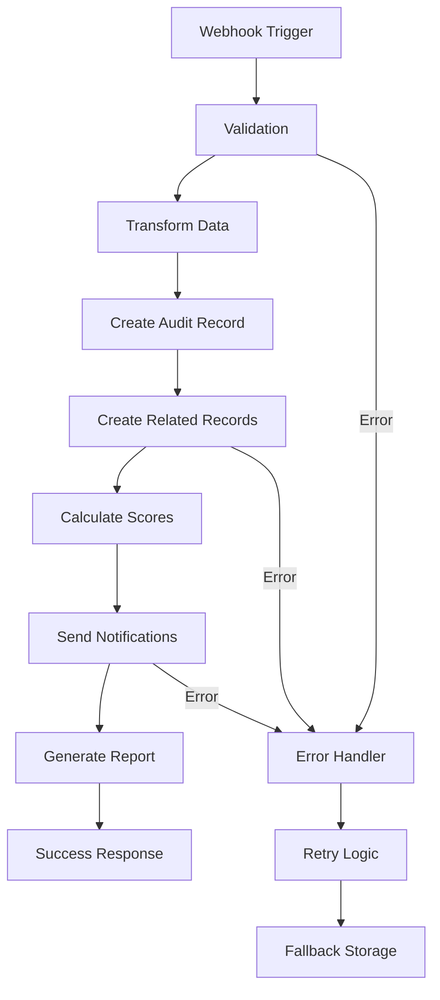

# N8N Workflow Schema - Intégration Formulaire Audit Digital

## Vue d'ensemble

Ce document détaille le workflow N8N pour traiter les soumissions du formulaire d'audit digital et les enregistrer dans Airtable.

## 1. Architecture du Workflow



## 2. Structure du Webhook (Entrée)

### URL du Webhook
```
https://n8n.digiqo.fr/webhook/audit-submission
```

### Headers requis
```json
{
  "Content-Type": "application/json",
  "X-API-Key": "votre-cle-api",
  "X-Source": "digiqo-website",
  "X-Version": "1.0.0"
}
```

### Payload JSON complet
```json
{
  "formData": {
    "general": {
      "companyName": "Entreprise Test",
      "sector": "E-commerce",
      "companySize": "10-20",
      "yearsFounded": "2020",
      "location": "Saint-Denis, La Réunion",
      "businessModel": "B2C",
      "companyAge": "3 ans",
      "teamSize": "2-5"
    },
    "digitalAssets": {
      "hasWebsite": true,
      "website": "https://example.com",
      "hasSocialMedia": true,
      "socialMedia": {
        "facebook": "https://facebook.com/example",
        "instagram": "https://instagram.com/example",
        "linkedin": "https://linkedin.com/company/example",
        "twitter": "",
        "tiktok": "",
        "youtube": ""
      },
      "hasGoogleMyBusiness": true,
      "businessListings": {
        "googleBusiness": "https://g.page/example",
        "tripadvisor": ""
      },
      "hasEcommerce": true,
      "salesPlatforms": ["Site propre", "Facebook Shop"]
    },
    "website": {
      "type": "e-commerce",
      "objectives": ["sell", "inform", "generate-leads"],
      "perceivedQuality": {
        "ux": 3,
        "mobile": 4,
        "speed": 3,
        "design": 4
      },
      "seo": {
        "optimized": true,
        "keywords": "produits locaux, La Réunion",
        "ranking": "page 1-2"
      },
      "tools": {
        "analytics": true,
        "pixel": true,
        "tagManager": false
      },
      "mobileOptimized": true,
      "performance": "good"
    },
    "socialMediaStrategy": {
      "activePlatforms": ["Facebook", "Instagram"],
      "publicationFrequency": "2-3 fois/semaine",
      "managedBy": "internal",
      "engagement": "medium"
    },
    "advertising": {
      "types": ["Facebook Ads", "Google Ads"],
      "testedPlatforms": ["Facebook", "Google"],
      "budget": "500-1000€/mois",
      "perceivedResults": "positive",
      "campaignObjectives": ["traffic", "conversions"],
      "conversionTunnel": true,
      "roi": "positive",
      "tracking": true
    },
    "content": {
      "hasPhotos": true,
      "hasVideos": false,
      "hasGraphics": true,
      "contentManaged": true,
      "contentTypes": ["photos", "graphics"],
      "productionMeans": "internal",
      "acquisitionFormats": ["création interne"],
      "brandConsistency": "good"
    },
    "conversion": {
      "leadGeneration": ["forms", "chat"],
      "estimatedConversionRate": "2-3%",
      "hasLandingPages": true,
      "hasForms": true,
      "hasCtaButtons": "many",
      "leadTracking": "basic",
      "leadNurturing": "manual",
      "salesProcess": "semi-automated",
      "crm": true,
      "dataAnalysis": "basic",
      "abTesting": false
    },
    "crm": {
      "hasCRM": true,
      "crmType": "HubSpot Free",
      "features": ["contacts", "deals"],
      "emailMarketing": true,
      "automation": false,
      "segmentation": true,
      "toolsUsed": ["HubSpot", "Mailchimp"],
      "automations": [],
      "integration": "partial",
      "dataQuality": "good"
    },
    "reputation": {
      "monitoring": true,
      "reviewsResponse": true,
      "averageRating": "4.0-4.5",
      "reviewPlatforms": ["Google", "Facebook"]
    },
    "objectives": {
      "goals": ["increase-revenue", "improve-conversion"],
      "challenges": "Concurrence forte, budget limité",
      "timeline": "3-6 months",
      "budget": "1000-2500€/mois"
    },
    "contact": {
      "firstName": "Jean",
      "lastName": "Dupont",
      "email": "jean.dupont@example.com",
      "phone": "0692123456",
      "preferredContact": "email",
      "preferredTimeSlot": "morning",
      "bestTime": "9h-11h en semaine"
    }
  },
  "scores": {
    "overall": 65,
    "categories": {
      "website": 70,
      "socialMedia": 60,
      "advertising": 75,
      "content": 50,
      "conversion": 65,
      "crm": 60,
      "reputation": 70
    },
    "strengths": ["Site Web", "Publicité", "Réputation"],
    "improvements": ["Contenu"],
    "recommendations": [
      {
        "priority": "high",
        "title": "Création de contenu vidéo",
        "description": "Intégrez des vidéos pour enrichir votre contenu",
        "impact": "Augmentation de l'engagement de 60%"
      },
      {
        "priority": "medium",
        "title": "Marketing automation",
        "description": "Automatisez vos campagnes email",
        "impact": "Gain de temps et meilleure conversion"
      }
    ]
  },
  "metadata": {
    "timestamp": "2024-01-20T10:30:00Z",
    "source": "website",
    "ip": "123.456.789.0",
    "userAgent": "Mozilla/5.0...",
    "completionPercentage": 100,
    "formVersion": "1.0.0"
  },
  "businessContext": {
    "estimatedBudget": "1000-2500€/mois",
    "priority": "medium",
    "leadScore": 75,
    "assignTo": "sales-team"
  }
}
```

## 3. Nodes du Workflow N8N

### Node 1: Webhook
```json
{
  "type": "n8n-nodes-base.webhook",
  "name": "Audit Webhook",
  "parameters": {
    "httpMethod": "POST",
    "path": "audit-submission",
    "responseMode": "onReceived",
    "responseData": "allEntries"
  }
}
```

### Node 2: Validation (Code Node)
```javascript
// Valider les données reçues
const requiredFields = ['formData', 'scores', 'metadata', 'businessContext'];
const data = $input.first().json;

for (const field of requiredFields) {
  if (!data[field]) {
    throw new Error(`Missing required field: ${field}`);
  }
}

// Valider l'email
const email = data.formData.contact?.email;
if (!email || !email.includes('@')) {
  throw new Error('Invalid email address');
}

// Générer une référence unique
const date = new Date();
const reference = `AUD-${date.getFullYear()}${String(date.getMonth() + 1).padStart(2, '0')}-${Math.floor(Math.random() * 9999).toString().padStart(4, '0')}`;

return {
  ...data,
  reference
};
```

### Node 3: Create Audit Record (Airtable)
```json
{
  "type": "n8n-nodes-base.airtable",
  "name": "Create Audit",
  "parameters": {
    "operation": "create",
    "application": "appjm4K9z1Px7ygXO",
    "table": "tblEbenlxn5FCfbND",
    "options": {
      "fields": {
        "Référence Audit": "={{ $json.reference }}",
        "Date Création": "={{ $json.metadata.timestamp }}",
        "Statut": "Nouveau",
        "Score Global": "={{ $json.scores.overall }}",
        "Priorité": "={{ $json.businessContext.priority }}",
        "Commercial Assigné": "={{ $json.businessContext.assignTo }}",
        "Source": "Website",
        "Montant Estimé": "={{ $json.businessContext.estimatedBudget }}"
      }
    }
  }
}
```

### Node 4: Create Entreprise Record
```json
{
  "type": "n8n-nodes-base.airtable",
  "name": "Create Entreprise",
  "parameters": {
    "operation": "create",
    "application": "appjm4K9z1Px7ygXO",
    "table": "tblszAkQnXjEusk0t",
    "options": {
      "fields": {
        "Nom Entreprise": "={{ $json.formData.general.companyName }}",
        "Secteur d'Activité": "={{ $json.formData.general.sector }}",
        "Taille Entreprise": "={{ $json.formData.general.companySize }}",
        "Localisation": "={{ $json.formData.general.location }}",
        "Lien Audit": ["={{ $node['Create Audit'].json.id }}"]
      }
    }
  }
}
```

### Node 5: Create Contact Record
```json
{
  "type": "n8n-nodes-base.airtable",
  "name": "Create Contact",
  "parameters": {
    "operation": "create",
    "application": "appjm4K9z1Px7ygXO",
    "table": "tblQmymIKJTjDwIy7",
    "options": {
      "fields": {
        "Prénom": "={{ $json.formData.contact.firstName }}",
        "Nom": "={{ $json.formData.contact.lastName }}",
        "Email": "={{ $json.formData.contact.email }}",
        "Téléphone": "={{ $json.formData.contact.phone }}",
        "Moyen de contact préféré": "={{ $json.formData.contact.preferredContact }}",
        "RGPD Consentement": true,
        "Audit lié": ["={{ $node['Create Audit'].json.id }}"]
      }
    }
  }
}
```

### Node 6: Send Email to Prospect (Email Node)
```json
{
  "type": "n8n-nodes-base.emailSend",
  "name": "Email Prospect",
  "parameters": {
    "fromEmail": "audit@digiqo.fr",
    "toEmail": "={{ $json.formData.contact.email }}",
    "subject": "Votre audit digital Digiqo - Référence {{ $json.reference }}",
    "text": "Bonjour {{ $json.formData.contact.firstName }},\n\nNous avons bien reçu votre demande d'audit digital.\n\nVotre référence : {{ $json.reference }}\nScore global : {{ $json.scores.overall }}%\n\nNous vous contacterons sous 24-48h.\n\nCordialement,\nL'équipe Digiqo"
  }
}
```

### Node 7: Notify Sales Team (Slack/Email)
```json
{
  "type": "n8n-nodes-base.slack",
  "name": "Notify Sales",
  "parameters": {
    "channel": "#sales-leads",
    "text": "🎯 *Nouvel audit reçu*\n\n*Entreprise:* {{ $json.formData.general.companyName }}\n*Score:* {{ $json.scores.overall }}%\n*Priorité:* {{ $json.businessContext.priority }}\n*Budget:* {{ $json.businessContext.estimatedBudget }}\n*Contact:* {{ $json.formData.contact.firstName }} {{ $json.formData.contact.lastName }}\n*Email:* {{ $json.formData.contact.email }}\n\n*Points forts:* {{ $json.scores.strengths.join(', ') }}\n*À améliorer:* {{ $json.scores.improvements.join(', ') }}",
    "attachments": [
      {
        "color": "={{ $json.businessContext.priority === 'high' ? '#ff0000' : $json.businessContext.priority === 'medium' ? '#ffa500' : '#00ff00' }}",
        "fields": [
          {
            "title": "Lead Score",
            "value": "{{ $json.businessContext.leadScore }}%",
            "short": true
          },
          {
            "title": "Assigné à",
            "value": "{{ $json.businessContext.assignTo }}",
            "short": true
          }
        ]
      }
    ]
  }
}
```

### Node 8: Error Handler
```javascript
// Gestion des erreurs
const error = $input.first().json.error;
const data = $input.first().json.data;

// Logger l'erreur
console.error('Audit submission error:', {
  error: error.message,
  stack: error.stack,
  data: data
});

// Stocker les données en local pour retry
// Ici vous pouvez ajouter une logique pour stocker dans une base de données temporaire

// Envoyer une notification d'erreur
return {
  error: true,
  message: error.message,
  reference: data?.reference || 'UNKNOWN',
  timestamp: new Date().toISOString(),
  shouldRetry: true
};
```

## 4. Configuration des Variables d'Environnement

Dans N8N, configurez les variables suivantes :

```bash
# Airtable
AIRTABLE_API_KEY=your_airtable_api_key
AIRTABLE_BASE_ID=appjm4K9z1Px7ygXO

# Email
SMTP_HOST=smtp.gmail.com
SMTP_PORT=587
SMTP_USER=audit@digiqo.fr
SMTP_PASS=your_password

# Slack (optionnel)
SLACK_WEBHOOK_URL=https://hooks.slack.com/services/xxx

# Sécurité
WEBHOOK_API_KEY=your_secure_api_key
```

## 5. Règles de Workflow

### Assignation automatique
```javascript
function assignCommercial(leadScore, budget) {
  if (leadScore >= 80 || budget.includes('10000')) {
    return 'senior-sales@digiqo.fr';
  } else if (leadScore >= 50) {
    return 'sales-team@digiqo.fr';
  } else {
    return 'junior-sales@digiqo.fr';
  }
}
```

### Calcul de priorité
```javascript
function calculatePriority(score, budget, timeline) {
  let priority = 0;
  
  // Score
  if (score >= 80) priority += 3;
  else if (score >= 60) priority += 2;
  else priority += 1;
  
  // Budget
  if (budget.includes('10000') || budget.includes('5000')) priority += 3;
  else if (budget.includes('2500')) priority += 2;
  else priority += 1;
  
  // Timeline
  if (timeline === 'immediate' || timeline === '< 1 month') priority += 3;
  else if (timeline === '1-3 months') priority += 2;
  else priority += 1;
  
  // Déterminer la priorité finale
  if (priority >= 7) return 'high';
  else if (priority >= 4) return 'medium';
  else return 'low';
}
```

## 6. Tests et Validation

### Endpoint de test
```bash
curl -X POST https://n8n.digiqo.fr/webhook/audit-submission \
  -H "Content-Type: application/json" \
  -H "X-API-Key: your-api-key" \
  -H "X-Source: digiqo-website" \
  -d @test-payload.json
```

### Réponse attendue
```json
{
  "success": true,
  "reference": "AUD-202401-1234",
  "message": "Audit successfully processed",
  "timestamp": "2024-01-20T10:30:00Z"
}
```

## 7. Monitoring et Alertes

### Métriques à surveiller
- Nombre d'audits reçus par jour
- Taux de conversion audit → client
- Score moyen des audits
- Temps de réponse commercial
- Taux d'erreur du workflow

### Alertes à configurer
- Audit avec score > 80% → Notification immédiate
- Erreur de workflow → Email à l'équipe technique
- Plus de 10 audits en attente → Alerte équipe commerciale
- Budget > 5000€ → Notification direction

## 8. Optimisations futures

1. **Enrichissement des données**
   - Intégration API SIRENE pour infos entreprise
   - Analyse SEO automatique du site
   - Scoring de réputation en ligne

2. **Automatisation avancée**
   - Génération automatique de propositions commerciales
   - Création de rapports PDF personnalisés
   - Planification automatique de rendez-vous

3. **Intelligence artificielle**
   - Prédiction du taux de conversion
   - Recommandations personnalisées par IA
   - Chatbot de qualification

## 9. Sécurité

### Bonnes pratiques
- Utiliser HTTPS pour tous les webhooks
- Valider l'API Key sur chaque requête
- Limiter le rate limiting (5 req/min par IP)
- Chiffrer les données sensibles
- Logs d'audit pour chaque opération
- Backup automatique des données

### RGPD Compliance
- Consentement explicite collecté
- Droit à l'oubli implémenté
- Export des données sur demande
- Durée de conservation : 3 ans max

---

## Support et Contact

Pour toute question sur l'intégration :
- Email : tech@digiqo.fr
- Documentation N8N : https://docs.n8n.io
- Documentation Airtable : https://airtable.com/api